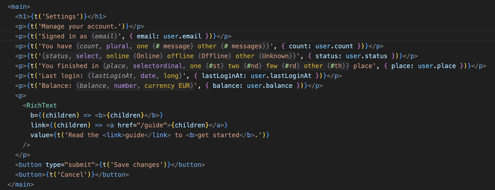
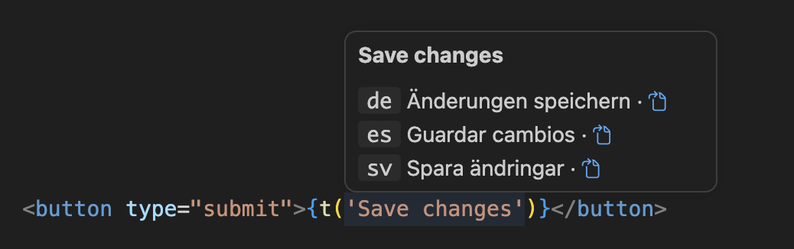
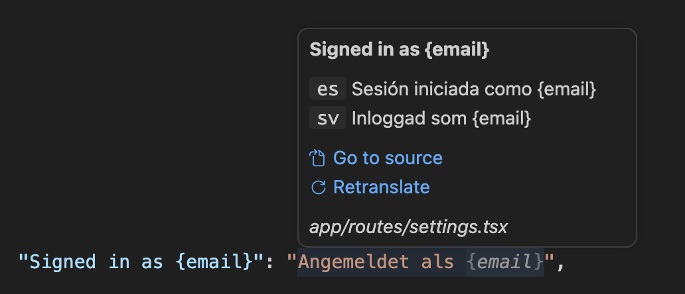
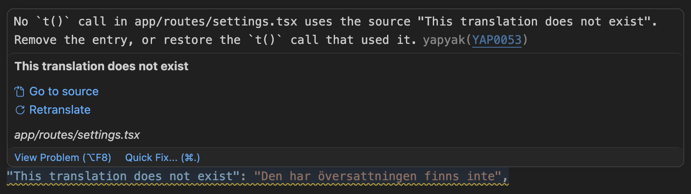
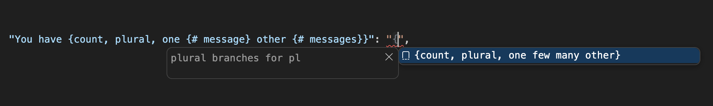
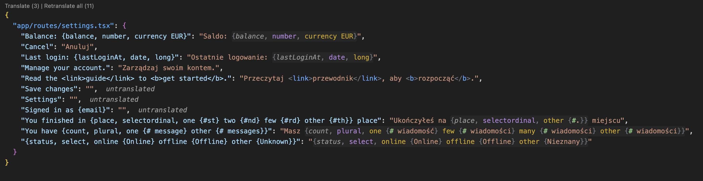
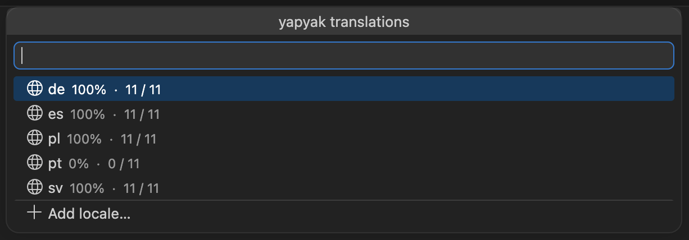
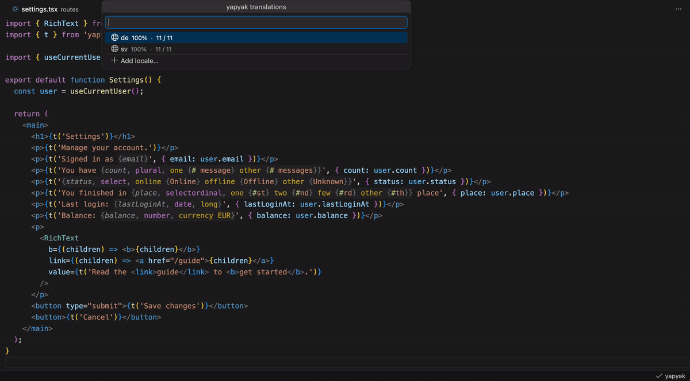
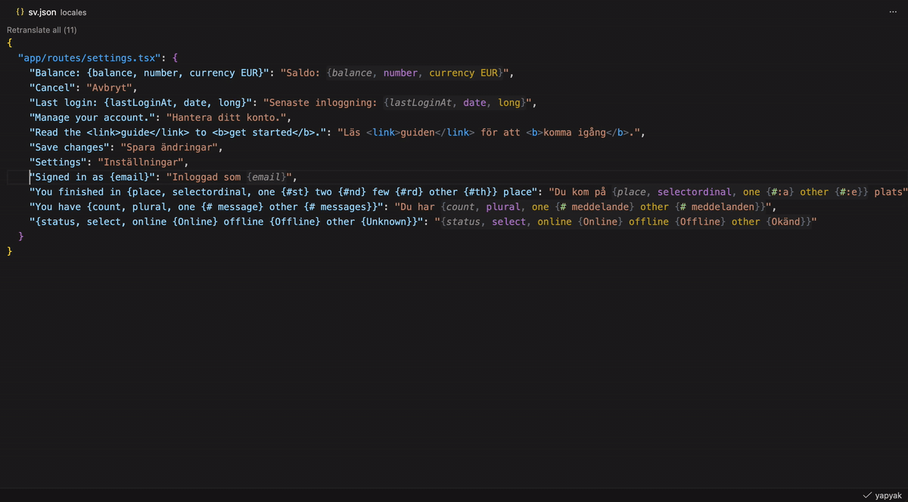

# yapyak

ICU highlighting, translations on hover, diagnostics and quick fixes as you type, and translation from the file you are editing.

## Installation

[Install via the Visual Studio Code Marketplace](https://marketplace.visualstudio.com/items?itemName=yapyak.yapyak)

Needs yapyak 0.0.9 or later and a `yapyak.config.ts` in your project. Translating from the editor needs a translator in the config; without one, the translate actions are hidden.

The extension uses the yapyak installed in your project and makes no network calls of its own.

## ICU highlighting

Placeholders, plural and select branches, `#` and rich-text tags, in source strings and locale files, nested to any depth.

## Hover

Hover a `t()` call for its translation in every locale, each linking to its locale file.

Hover an entry in a locale file for the source string and the other locales, with links to the `t()` call and to translate or retranslate the entry.

## Diagnostics and quick fixes

The compiler's diagnostics as you type, each linked to its docs page. In a locale file: a value that does not parse, a placeholder that does not match the source, a placeholder name that is not an identifier, and an entry no `t()` call uses, shown dimmed. Empty stubs are marked `untranslated`. Quick fixes rename, add or remove; `Fix all` applies every unambiguous fix in the file.

A missing, unused or misspelled placeholder parameter is reported both by yapyak, with its docs link, and by TypeScript wherever it checks the call. VS Code has no API for an extension to hide another's diagnostics, so both stay.

## Completions

Type `{` in a source string for the placeholder shapes and their styles. In a locale file, `{` completes the placeholders of the source string, and a plural expands to the CLDR categories of that locale.

## Translate from the editor

`Translate (N)` above a locale file fills its empty stubs; `Retranslate all (N)` redoes every entry. The hover on an entry translates that entry. Each runs the yapyak CLI from your project and streams its output to a notification.

## Status bar

`Untranslated (N)` counts the empty stubs across every locale. `Translating (N)` shows while the dev server or the CLI translates, `Failed (N)` when a run left translations behind. Click it for the count per locale, the failed translations, and `Add locale`.

## Go to source

Cmd/Ctrl+click an entry in a locale file to jump to its `t()` call, or the path key to open the source file. The hover on the `t()` call links back to every locale file.

## Add locale

`yapyak: Add locale`, from the palette or the panel, validates the BCP 47 tag as you type, suggests the closest valid one, and runs `yapyak add`.
